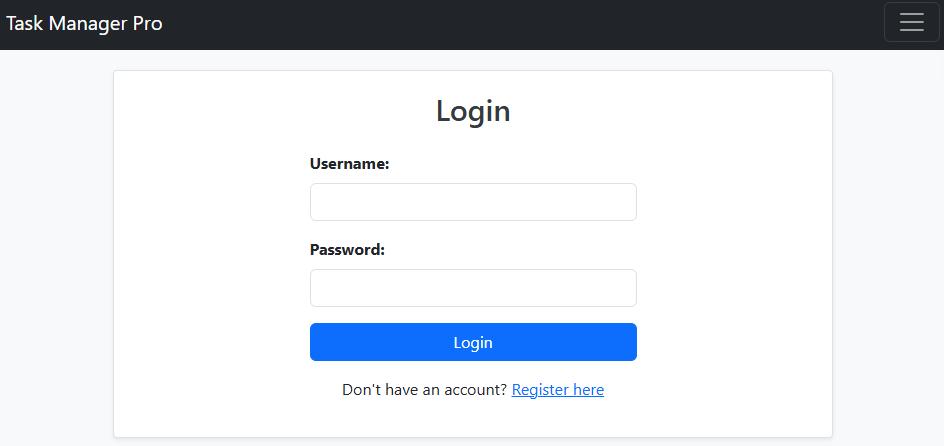
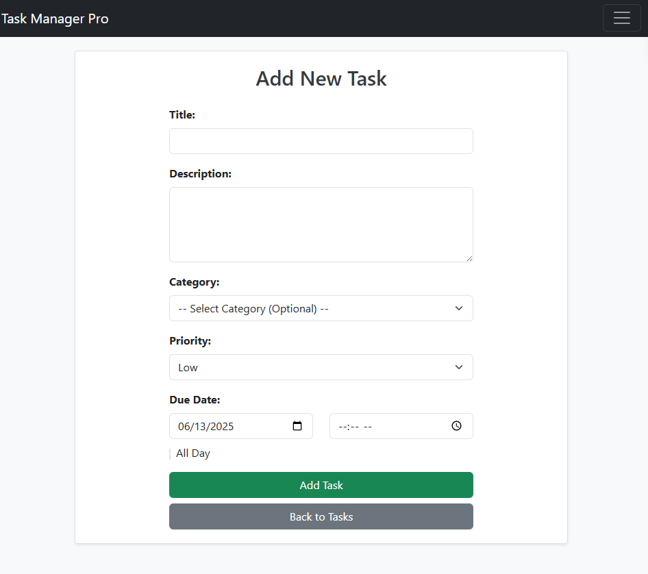
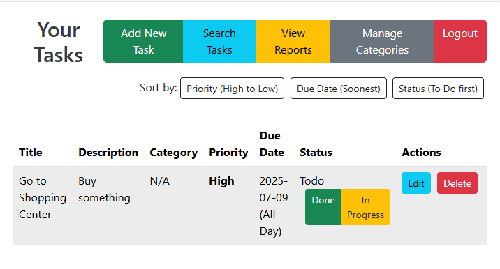
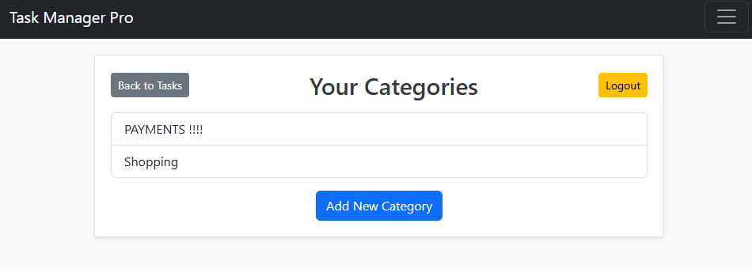

Personal Task Manager Pro
Project Overview
This is a robust Personal Task Manager Pro web application developed using pure PHP, MySQL with PDO for secure database access, and a clear Model-View-Controller (MVC) architectural pattern. It's designed to help users effectively manage their daily tasks, offering a comprehensive set of features from user authentication to advanced reporting and task management functionalities.

The project demonstrates complex database interactions, advanced routing, detailed validation, and a strong focus on security and maintainability. Its user interface is enhanced with Bootstrap 5 for a modern and responsive design.

Features
This application provides the following key functionalities:

User Authentication:

Secure user Registration with password hashing (password_hash()).
Login and Logout functionality using PHP sessions ($_SESSION).
Robust input validation for username (3-50 chars), email (valid format), and password (min 6 chars).

Task Management (CRUD):

Create: Add new tasks with title, description, category, priority (low/medium/high), and due date. Due dates can be specific or marked as "All Day."
Read (List): View all tasks with full details, including categorization and status indicators.
Update (Edit): Modify existing tasks including title, description, category, priority, due date, and status.
Status Management: Quickly change task status to "To Do," "In Progress," or "Done" directly from the list. completed_at timestamp is recorded upon completion.
Delete: Remove tasks securely, requiring user ownership confirmation.

Category Management:

Add and list custom categories for task organization. Category names are unique per user.

Task Search & Filtering:

Filter tasks by Category, Priority, and Status. (Initial search by term functionality is simplified to focus on filter options).
Task Reporting:

Generate comprehensive reports:
Tasks by Status: Counts of tasks in "To Do," "In Progress," and "Done" states.
Overdue Tasks: Count of tasks past their due date and not yet completed.
Category Summary: Breakdown of tasks per category, showing total and completed tasks.

Task Sorting:

Sort tasks on the main list by Priority, Due Date, or Status.

Security & Validation:

All database queries utilize PDO prepared statements to prevent SQL injection.
All user inputs and outputs are properly escaped using htmlspecialchars() to prevent XSS attacks.
Strict server-side validation is implemented across all forms to ensure data integrity and user-friendly error messages.
MVC Architecture:

Clear separation of concerns into models (database logic), views (HTML templates), and controllers (business logic and routing).
Responsive UI:

Integrated Bootstrap 5 for a modern, clean, and responsive user interface across various devices.
Technologies Used
Backend: PHP (Pure PHP, PDO)
Database: MySQL
Frontend: HTML, CSS, JavaScript, Bootstrap 5
Development Tools: XAMPP (Apache, MySQL), VS Code, Git, GitHub

Setup Instructions
To get the Personal Task Manager Pro up and running on your local machine, follow these steps:

Install XAMPP:

Download and install XAMPP (or WAMP/MAMP) from apachefriends.org.
Ensure Apache and MySQL services are running via the XAMPP Control Panel.
Clone the Repository:

Open your Git Bash or terminal.
Navigate to your XAMPP's htdocs directory (e.g., cd C:\xampp\htdocs\).
Clone this repository:
Bash

git clone https://github.com/gorselguler/Personal_Task_Manager_Pro.git
This will create a Personal_Task_Manager_Pro folder inside htdocs.
Configure php.ini:

Open your XAMPP Control Panel.
Click "Config" next to Apache, then select "PHP (php.ini)".
Find and uncomment (remove the semicolon ;) the following lines:
Ini, TOML

extension=pdo_mysql
extension=mysqli
Save and close php.ini.
Restart Apache from the XAMPP Control Panel.
Configure Database Connection (config.php):

Open Personal_Task_Manager_Pro/config.php in your code editor.
Verify or update the database connection constants if necessary (default XAMPP settings usually work):

'''php

define('DB_HOST', 'localhost');
define('DB_NAME', 'task_manager_pro');
define('DB_USER', 'root');
define('DB_PASS', ''); // Usually empty for XAMPP root user
Create Database and Tables:

Open your web browser and go to http://localhost/phpmyadmin/.
Click on "Databases" and create a new database named task_manager_pro.
Select the task_manager_pro database from the left sidebar.
Go to the "SQL" tab and paste the following SQL commands to create the necessary tables and populate with test data:

'''sql

SET FOREIGN_KEY_CHECKS = 0;
DROP TABLE IF EXISTS tasks;
DROP TABLE IF EXISTS categories;
DROP TABLE IF EXISTS users;

CREATE TABLE users (
    id INT AUTO_INCREMENT PRIMARY KEY,
    username VARCHAR(50) NOT NULL UNIQUE,
    password VARCHAR(255) NOT NULL,
    email VARCHAR(100) NOT NULL UNIQUE,
    created_at DATETIME DEFAULT NOW()
);

CREATE TABLE categories (
    id INT AUTO_INCREMENT PRIMARY KEY,
    user_id INT NOT NULL,
    name VARCHAR(50) NOT NULL,
    FOREIGN KEY (user_id) REFERENCES users(id) ON DELETE CASCADE,
    UNIQUE (user_id, name)
);

CREATE TABLE tasks (
    id INT AUTO_INCREMENT PRIMARY KEY,
    user_id INT NOT NULL,
    category_id INT NULL,
    title VARCHAR(100) NOT NULL,
    description TEXT,
    priority ENUM('low', 'medium', 'high') DEFAULT 'medium',
    due_date DATETIME NULL,
    status ENUM('todo', 'in_progress', 'done') DEFAULT 'todo',
    created_at DATETIME DEFAULT NOW(),
    completed_at DATETIME NULL,
    FOREIGN KEY (user_id) REFERENCES users(id) ON DELETE CASCADE,
    FOREIGN KEY (category_id) REFERENCES categories(id) ON DELETE SET NULL
);
'''

Usage Guide
Access the Application:

Open your web browser and navigate to: http://localhost/Personal_Task_Manager_Pro/public/

Login:
Use the provided demo credentials:

Username: mr.poplawski

Password: Test123

Alternatively, click "Register here" to create a new account.

Explore Features:

Add, edit, delete tasks.
Change task statuses.
Manage categories.
Search and filter tasks.
View reports.
Sort task list.

